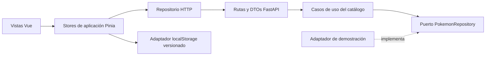

# PokeShop

[English](README.md) · [Español](README.es.md)

Tienda Pokémon de demostración con Vue 3, TypeScript y FastAPI. Explora Kanto,
filtra Pokémon, consulta sus fichas y conserva tu carrito al recargar el navegador.
Las cuentas, pedidos y pagos quedan para una fase posterior.

## Arranque con Docker

Requiere Docker Desktop con contenedores Linux y Docker Compose v2.

```sh
docker compose up --build --wait
```

- Frontend: http://localhost:5173
- Documentación de la API: http://localhost:8000/docs
- Salud de la API: http://localhost:8000/health

Si un puerto está ocupado, copia `.env.example` a `.env` en la raíz y modifica
`FRONTEND_PORT` o `BACKEND_PORT`. CORS se adapta al puerto del frontend.
El `.env` está ignorado por Git. Los cambios se recargan automáticamente,
también en Windows/WSL. Las dependencias de Vue usan un volumen Linux separado.

## Funcionalidad disponible

- Doce Pokémon con ilustraciones, tipos, descripción, precios ficticios en EUR
  y disponibilidad. El catálogo procede de FastAPI, no está incrustado en Vue.
- Búsqueda por nombre o Pokédex (`#025`), filtro por tipo y ordenación por precio,
  nombre o número.
- Fichas, carrito con cantidades limitadas al stock, totales en céntimos y estados vacíos.
- Persistencia versionada en el navegador con solo identificadores y cantidades.
  Al restaurar, las cantidades se ajustan al stock y los precios se toman del catálogo.
- Estados de carga, error con reintento, imagen no disponible, Pokémon o página inexistentes.
- Diseño adaptable a escritorio/móvil, controles etiquetados, foco de teclado y movimiento reducido.

El catálogo usa un **repositorio de demostración de solo lectura**. PostgreSQL y
Redis están preparados en Compose, pero todavía no se utilizan para el catálogo.
No hay modelos, migraciones, semillas automáticas, reservas de stock ni pedidos.
El carrito pertenece al navegador y no constituye un pedido o una reserva.

## Arquitectura



Las entidades y los puertos del backend no dependen de FastAPI. Los casos de uso
implementan búsqueda y paginación; la presentación compone el repositorio de
prueba y valida el contrato HTTP. En Vue se separan tipos de dominio, lógica de
filtros/carrito, adaptadores HTTP/almacenamiento y vistas por contexto.
El frontend carga el pequeño catálogo una vez y filtra localmente; la API también
ofrece filtros y paginación para una futura colección más grande.

```text
backend/src/pokemon/{domain,application,infrastructure,presentation}
frontend/src/pokemon/{domain,application,infrastructure,presentation}
frontend/src/cart/{domain,application,infrastructure,presentation}
frontend/src/shared/presentation/  # formato
```

Los contextos `user` siguen reservados para la futura funcionalidad de cuentas.

## Stack y recursos

Python 3.12 / Poetry 2.1.3; Vue 3 / TypeScript / Vite 7 / Pinia / Vue Router /
Tailwind CSS 4; Node 22 / pnpm 10.10.0. Ambos lockfiles están versionados.

| Contenedor | Límite de memoria |
| --- | --- |
| Frontend | 1 GiB |
| Backend | 512 MiB |
| PostgreSQL 16 | 256 MiB |
| Redis 7 | 128 MiB |

Total: **1.920 MiB**, sin swap adicional por contenedor. Redis limita los datos de
caché a 64 MiB con expulsión LRU. Los límites no incluyen Docker Desktop ni los
procesos de construcción de imágenes. Consulta [recursos de desarrollo](docs/development.md).
Solo se publican los puertos web en localhost. Los datos de PostgreSQL y Redis
persisten en volúmenes con nombre.

## Comandos y verificación

```sh
docker compose ps
docker stats --no-stream
docker compose logs -f

docker compose exec frontend pnpm build
docker compose exec frontend pnpm test:unit --run
docker compose exec frontend pnpm exec eslint .
docker compose exec backend python -m unittest discover -s tests -v

docker compose exec frontend pnpm add <paquete>
docker compose up --build --wait

# Detener sin borrar datos
docker compose down
```

Verificados: 9 tests del backend, 7 tests unitarios del frontend, tipos, build de
producción, ESLint y comprobaciones en navegador de búsqueda, filtros, ficha,
cantidades y persistencia al recargar. Se revisaron las vistas de escritorio y móvil.
Se incluye un escenario de regresión Playwright en `frontend/e2e`; ejecutarlo
requiere instalar los navegadores (consulta el README del frontend).

Desarrollo sin Docker: [frontend](frontend/README.md), [backend](backend/README.md).
Para Vue local, configura `API_PROXY_TARGET` si la API no utiliza el puerto 8000.

## Alcance y atribución

Compose utiliza servidores de desarrollo; no hay despliegue de producción.
`docker compose down -v` elimina los volúmenes de base de datos, Redis y dependencias.

Las ilustraciones proceden de [PokéAPI sprites](https://github.com/PokeAPI/sprites)
y necesitan conexión; los datos del catálogo no dependen del servicio externo PokéAPI.
Pokémon y sus ilustraciones pertenecen a sus respectivos titulares.
Este es un proyecto educativo independiente con precios y stock ficticios.
