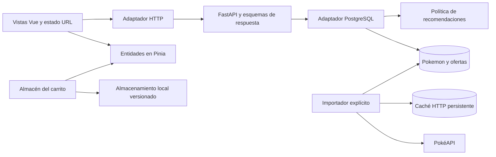

# PokeShop

[English](README.md) · [Español](README.es.md)


Una tienda Pokémon de demostración con portada promocional basada en el peso, catálogo completo importado y carrito persistente. Creada con Vue 3, TypeScript y FastAPI. Precios y stock ficticios; las cuentas, pagos y pedidos reales quedan fuera de esta fase.

[Demo local](http://localhost:5173) · [Documentación de la API](http://localhost:8000/docs)

[](docs/home.png)

## Funcionalidades

- `/`: seis destacados en un bento cuyo tamaño representa categorías de peso real: ligero ≤ 10 kg, medio ≤ 100 kg y pesado > 100 kg. Los accesos por generación abren el catálogo filtrado.
- `/catalogo`: búsqueda en servidor, filtros por tipo/generación/forma, orden por número/nombre/precio/peso y páginas de 24. Filtros y página se guardan en la URL; las peticiones obsoletas se cancelan.
- `/pokemon/:id`: número de especie, nombre diferenciador de forma, descripción localizada, kg/metros, habilidades y seis estadísticas base etiquetadas.
- `/carrito`: IDs y cantidades sobreviven a las recargas. Las entidades son independientes de las páginas del catálogo; los errores de red no borran la selección ni se interpretan como falta de stock.
- Cuatro recomendaciones disponibles priorizan tipos compartidos, después generación y proximidad de precio. No repiten especie y excluyen las especies seleccionadas. El carrito vacío muestra destacados.
- Español/inglés con Vue I18n, selectores accesibles de Reka UI, iconos Lucide, temas claro/oscuro/sistema y revelación circular de 350 ms para cambios manuales. El movimiento reducido y los cambios automáticos del sistema omiten la animación; los navegadores sin soporte usan un fundido breve.

## Ejecución local

Requiere Docker Desktop con contenedores Linux y Compose v2.

```sh
docker compose up --build --wait
docker compose exec backend alembic upgrade head
docker compose exec backend python -m src.pokemon.infrastructure.sync
```

Abre http://localhost:5173. Salud de la API: http://localhost:8000/health.
Si un puerto está ocupado, copia `.env.example` a `.env` y cambia `FRONTEND_PORT` o `BACKEND_PORT`. Este entorno de desarrollo usa `FRONTEND_PORT=5174`; ese ajuste local no se incluye en Git. CORS sigue el puerto configurado.

Los cambios de código se recargan automáticamente, también en Windows/WSL. Las dependencias del frontend viven en un volumen Linux y utilizan **solo pnpm**. La primera importación requiere internet; después la navegación consulta PostgreSQL. Las ilustraciones siguen siendo remotas.

## Importación y actualización de datos

El importador explícito recorre todas las páginas de `/pokemon` de PokéAPI. La primera importación verificada el 07/09/2026 contiene **1.351 entradas de nueve generaciones de especies**. Es la cantidad observada en origen, no un límite fijo.

Cada recurso distinto de `/pokemon` corresponde a un producto, incluidas sus formas alternativas. No se generan productos adicionales a partir de variantes cosméticas de `/pokemon-form` ni sprites shiny. El ID de entrada identifica rutas y líneas del carrito; `species_id` es el número de Pokédex nacional mostrado. La generación de una forma corresponde a **su especie**, no a la generación en la que apareció esa forma.

Se guardan nombres en español/inglés, descripciones de especie disponibles, nombres de formas, habilidades localizadas y estadísticas base. Los hectogramos y decímetros de origen se convierten a kg y metros. Cuando falta una descripción en el idioma elegido, la interfaz compone una descripción factual localizada con tipo, peso y altura.

```sh
# Reanudar/repetir usando la caché HTTP persistente de PostgreSQL
docker compose exec backend python -m src.pokemon.infrastructure.sync
# Actualizar explícitamente las respuestas de origen, incluidas las listas
docker compose exec backend python -m src.pokemon.infrastructure.sync --refresh
```

Se ejecutan como máximo cuatro peticiones HTTP simultáneas, con tres intentos por recurso y espera limitada entre intentos. Cada producto completo se confirma independientemente. Los fallos se notifican y producen una salida no exitosa; las filas ya importadas permanecen. Repetir tras una interrupción reutiliza recursos en caché y actualiza los datos biológicos sin duplicarlos. El importador no borra entradas ausentes en origen.

`pokemon` guarda datos biológicos; `offers`, valores comerciales. Se conservan los precios y stock de los 12 originales. Las ofertas nuevas empiezan en **29,90 € y 10 unidades ficticias**; una sincronización nunca sobrescribe ofertas existentes. `api_cache` conserva respuestas HTTP y fechas en el volumen de la base de datos. Ejecuta el importador dentro del contenedor backend existente, como indican los comandos anteriores.

## API

| Endpoint | Comportamiento |
| --- | --- |
| `GET /api/v1/pokemon` | `{ items, total }`; `q`, `type`, `generation`, `forms=all/default/alternative`, `sort`, `limit` (24 por defecto, máximo 100), `offset` |
| `/api/v1/pokemon/{id}` | Producto ampliado; 404 si no existe |
| `/api/v1/pokemon/metadata` | Tipos y generaciones disponibles |
| `/api/v1/pokemon/featured` | Selección editorial |
| `/api/v1/pokemon/batch?ids=25,10100` | Hasta 100 IDs de entrada para recuperar el carrito |
| `/api/v1/pokemon/recommendations?ids=25` | Cuatro sugerencias disponibles, sin repetir especie, con motivo |

Órdenes: `number`, `name`, `price_asc`, `price_desc`, `weight_asc`, `weight_desc`. Las búsquedas numéricas encuentran especies y por tanto incluyen sus formas alternativas. Se conservan los campos anteriores; el contrato tipado completo está en `/docs`.

## Arquitectura y decisiones



Los filtros, totales y paginación se ejecutan en PostgreSQL. La ordenación de recomendaciones es una política de aplicación independiente del almacenamiento. Los metadatos biológicos multilingües viven en JSONB; las ofertas comerciales tienen restricciones propias y se guardan aparte. El adaptador de demostración permanece únicamente para pruebas aisladas y los valores comerciales originales; no sirve el catálogo en ejecución. Redis está preparado, pero este catálogo no lo utiliza.

```text
backend/migrations/                     # Versiones Alembic del esquema
backend/src/pokemon/application/        # Políticas de catálogo y recomendaciones
backend/src/pokemon/infrastructure/     # PostgreSQL e importador reanudable
backend/src/pokemon/presentation/       # Rutas y esquemas tipados
frontend/src/pokemon/                   # Entidades, HTTP, portada/catálogo/ficha
frontend/src/cart/                      # Selección persistente y presentación
frontend/src/shared/                    # Formatos, tema y preferencias
frontend/src/i18n/                      # Diccionarios de interfaz ES/EN
frontend/e2e/                           # Regresiones de navegador y capturas
```

## Stack y límites de memoria

Python 3.12, Poetry 2.1.3, FastAPI, SQLAlchemy/asyncpg, Alembic; Vue 3, TypeScript, Vite 7, Pinia, Vue Router, Vue I18n 11, Reka UI, Lucide, Tailwind CSS 4; Node 22 y pnpm 10.10.0. Ambos lockfiles están versionados.

| Contenedor | Límite de memoria |
| --- | --- |
| Frontend | 1 GiB |
| Backend, incluido el importador | 512 MiB |
| PostgreSQL 16 | 256 MiB |
| Redis 7 | 128 MiB |

Total: **1.920 MiB**, sin swap adicional para los contenedores. Redis limita los datos a 64 MiB con expulsión LRU. No se incluye Docker Desktop ni la construcción de imágenes. Solo se publican los puertos web, vinculados a localhost. Consulta los [detalles de recursos](docs/development.md).

## Verificación y comandos

Ejecuta secuencialmente las comprobaciones que consumen más recursos:

```sh
docker compose exec backend python -m unittest discover -s tests -v
docker compose exec frontend pnpm test:unit --run
docker compose exec frontend pnpm type-check
docker compose exec frontend pnpm exec eslint .
docker compose exec frontend pnpm build-only

# Instalar Chromium una vez en el contenedor actual y ejecutar las pruebas
docker compose exec frontend pnpm exec playwright install --with-deps chromium
docker compose exec frontend pnpm test:e2e

docker compose ps
docker stats --no-stream
docker compose logs -f
# Detener conservando los volúmenes
docker compose down
```

Verificado el 07/09/2026: 12 pruebas de backend y 17 pruebas unitarias de frontend; tipos, ESLint, build de producción y Ruff. Chromium pasó tanto contra el servidor de desarrollo como contra el preview de producción. La cobertura de navegador contiene dos regresiones de interacción y 20 escenarios responsive, cada uno recorriendo las cuatro rutas a 320/375/414/768/1280 px en español/inglés y claro/oscuro (80 capturas). Se comprueban la carga correcta y los desbordamientos horizontales; las capturas se generan en `frontend/test-results/`, ignorado en Git, para revisión visual. Se cubren selección con teclado, Escape y recuperación del foco, carrito tras paginación/recarga/error de red y persistencia de preferencias. También se ejecutaron repetición, interrupción controlada y recuperación de la importación.

Las pruebas de integración requieren la migración y sincronización inicial. Las de navegador utilizan Chromium y el servidor de desarrollo encendido; configura `PLAYWRIGHT_BASE_URL` para otro servidor. No se han verificado otros motores de navegador. `pnpm build` también ejecuta tipos y empaquetado secuencialmente.

## Alcance y atribución

Compose utiliza servidores de desarrollo. No hay despliegue de producción, cuentas, reservas de stock, compras reales ni pagos. El carrito del navegador no es un pedido autoritativo. `docker compose down -v` elimina los volúmenes locales de base de datos, Redis y dependencias frontend.

Datos: [PokéAPI](https://pokeapi.co/docs/v2). Ilustraciones: [PokéAPI sprites](https://github.com/PokeAPI/sprites). Pokémon y sus ilustraciones pertenecen a sus respectivos titulares. Es un proyecto educativo independiente.
