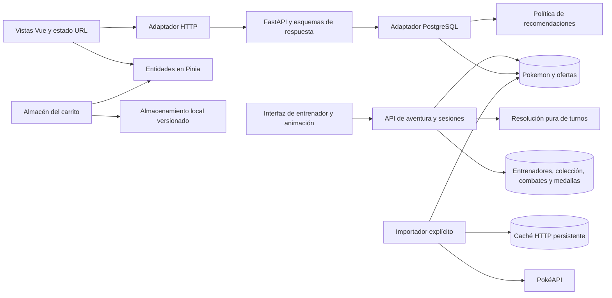

# PokeShop

[English](README.md) · [Español](README.es.md)


Una tienda Pokémon de demostración con portada a todo el ancho con los tres iniciales de Kanto, catálogo completo importado, carrito de demostración persistente y una aventura de entrenadores por invitación. Forma un equipo con créditos ficticios y reta a seis líderes en combates por turnos controlados por el servidor. Creada con Vue 3, TypeScript y FastAPI, sin pagos ni pedidos reales.

[Repositorio](https://github.com/kevin0018/PokeShop) · [Demo pública](https://pokeshop-app.duckdns.org) · [Documentación local de la API](http://localhost:8000/docs)

[](docs/home.png)

[Vista del catálogo](docs/catalog.png) · [Catálogo con entrenador](docs/catalog-trainer.png) · [Vista del carrito](docs/cart.png) · [Combate de aventura](docs/adventure.png) · [Combate en móvil](docs/adventure-mobile.png)

[Centro Pokémon](docs/center.png) · [PC de la colección](docs/collection-pc.png) · [Líderes de gimnasio](docs/gyms.png)

## Funcionalidades

- `/aventura`: cuentas por invitación con 1.000 créditos ficticios iniciales. Selecciona y guarda el equipo en un Centro Pokémon; su PC en pixel art abre la colección en cajas de 30 plazas y permite vender con confirmación del reembolso. Seis gimnasios consecutivos tienen retratos de sus líderes y colores por tipo. Dos franjas negras dan paso al combate: desaparecen navegación y footer, el escenario del gimnasio ocupa el fondo de la ventana y el indicador de turno abre un historial persistente por turno y participante. Compras, turnos y premios se resuelven en el servidor y se conservan al recargar. [Reglas, acceso, despliegue y pruebas](docs/adventure.es.md).
- `/`: collage a todo el ancho de Bulbasaur, Charmander y Squirtle, sin marco de tarjeta. Los colores por tipo forman el fondo; se mantienen los accesos al catálogo y Kanto. La portada se muestra directamente. El movimiento reducido desactiva las animaciones decorativas; el fondo se detiene fuera de pantalla y con la pestaña oculta.
- `/catalogo`: toldo azul y mostrador en pixel art integrados con un catálogo bento ordenado: una tarjeta grande, dos horizontales y tres pequeñas por bloque completo. Dos columnas en tablet y una en móvil; los bloques incompletos conservan el orden sin solaparse. Los entrenadores ven saldo, precios en créditos y los 26 Pokémon de Kanto disponibles para combatir por defecto. Las compras pasan por el carrito existente. Búsqueda y filtros conservan el estado en URL y Aplicar/Cancelar.
- `/pokemon/:id`: biología localizada, dimensiones y origen. Las estadísticas se abren desde la esquina superior derecha de la ilustración con hover, foco o toque; un clic fija el popover y Escape, pulsación fuera o Cerrar lo cierran. Las habilidades permanecen en la API, pero se omiten en la vista.
- `/carrito`: seis productos distintos por página y totales calculados sobre toda la cesta. Eliminar el último producto de una página ajusta a la última válida; cambiar cantidades mantiene la página. IDs y cantidades persisten, independientemente de la paginación del catálogo y los fallos de red. Los entrenadores confirman una compra atómica validada por el servidor; los recibos persistentes evitan cobrar de nuevo tras perder una respuesta. Los visitantes sin sesión mantienen el carrito de demostración en euros.
- Cuatro recomendaciones disponibles priorizan tipos compartidos, después generación y proximidad de precio. No repiten especie y excluyen las especies seleccionadas. El carrito vacío muestra destacados.
- Español/inglés con Vue I18n, selectores accesibles de Reka UI, iconos Lucide, temas claro/oscuro con detección inicial de la preferencia del navegador y revelación circular de 700 ms para cambios manuales. El movimiento reducido y los cambios automáticos del sistema omiten la animación; los navegadores sin soporte transicionan los colores durante 300 ms, sin atenuar la página. El tema claro utiliza superficies crema; el oscuro combina grafito con matiz violeta y el acento morado original. El inicio conserva el fondo verde, naranja y azul de los tres iniciales.

Chansey aparece con 180–240 px según el ancho de pantalla debajo del resumen con aspecto de ticket, tanto en escritorio como en móvil y también acompaña el estado vacío. Los avisos de tres segundos usan un disco que se vacía, se pausan con hover/foco y se reinician con cada acción. Los errores de almacenamiento permanecen visibles. Un switch animado Espeon/Umbreon selecciona claro/oscuro, usando inicialmente la preferencia del navegador y recordando las elecciones manuales. Se conserva la revelación de página de 700 ms.

La cabecera permite previsualizar los tres últimos productos distintos añadidos y el total de toda la cesta con hover, teclado, clic o toque. «Ver carrito completo» abre la lista; «Vaciar carrito» elimina toda la selección guardada. El orden reciente persiste sin reordenar las páginas del carrito.

La paleta por tipo se comparte entre catálogo, fondo de ficha, miniaturas del carrito y preview. El ticket recibe un matiz del último producto añadido.

## Ejecución local

Requiere Docker Desktop con contenedores Linux y Compose v2.

```sh
cp .env.example .env
# Configura POSTGRES_PASSWORD en .env antes de arrancar
docker compose up --build --wait
docker compose exec backend alembic upgrade head
docker compose exec backend python -m src.pokemon.infrastructure.sync
```

Abre http://localhost:5173. Salud de la API: http://localhost:8000/health.
Si un puerto está ocupado, edita `.env` y cambia `FRONTEND_PORT` o `BACKEND_PORT`. Este entorno de desarrollo usa `FRONTEND_PORT=5174`; ese ajuste local no se incluye en Git. CORS sigue el puerto configurado.

Los cambios de código se recargan automáticamente, también en Windows/WSL. Las dependencias del frontend viven en un volumen Linux y utilizan **solo pnpm**. La primera importación requiere internet; después la navegación consulta PostgreSQL. Las ilustraciones siguen siendo remotas.

## Importación y actualización de datos

El importador explícito recorre todas las páginas de `/pokemon` de PokéAPI. La primera importación verificada el 07/09/2026 contiene **1.351 entradas de nueve generaciones de especies**. Es la cantidad observada en origen, no un límite fijo.

Cada recurso distinto de `/pokemon` corresponde a un producto, incluidas sus formas alternativas. No se generan productos adicionales a partir de variantes cosméticas de `/pokemon-form` ni sprites shiny. El ID de entrada identifica rutas y líneas del carrito; `species_id` es el número de Pokédex nacional mostrado. La generación de una forma corresponde a **su especie**, no a la generación en la que apareció esa forma.

Se guardan nombres en español/inglés, descripciones de especie disponibles, nombres de formas, habilidades localizadas y estadísticas base. Los hectogramos y decímetros de origen se convierten a kg y metros. Cuando falta una descripción en el idioma elegido, la interfaz compone una descripción factual localizada con tipo, peso y altura.

```sh
# Reanudar/repetir usando la caché HTTP persistente de PostgreSQL
docker compose exec backend python -m src.pokemon.infrastructure.sync
# Actualizar explícitamente las respuestas de origen, incluidas las listas
docker compose exec backend python -m src.pokemon.infrastructure.sync --refresh
```

Se ejecutan como máximo cuatro peticiones HTTP simultáneas, con tres intentos por recurso y espera limitada entre intentos. Cada producto completo se confirma independientemente. Los fallos se notifican y producen una salida no exitosa; las filas ya importadas permanecen. Repetir tras una interrupción reutiliza recursos en caché y actualiza los datos biológicos sin duplicarlos. El importador no borra entradas ausentes en origen.

`pokemon` guarda biología; `offers`, base en céntimos, precio, stock, versión de política y desglose. Las 1.351 ofertas se recalcularon con `classic-v1`, conservando el stock. Los nuevos productos reciben la política vigente y 10 unidades ficticias; las sincronizaciones biológicas posteriores conservan ofertas existentes. `api_cache` persiste respuestas de origen en PostgreSQL.

## Regiones y precios ficticios

La región indica el origen de especie o forma, no todos los lugares donde se encuentra. Se usa la región principal de su generación, con excepciones para formas de Alola/Galar/Hisui/Paldea. Wyrdeer, Kleavor, Ursaluna, Basculegion, Sneasler, Overqwil y Enamorus proceden explícitamente de Hisui. La etapa evolutiva es la profundidad en la cadena de especies (raíz = 1); Mega/Gigamax heredan la etapa de su especie.

```text
precio = 30 € × (1 + 0,05 × peso_kg) × (1 + 0,10 × (etapa − 1)) × factor generación × factor región
```

Factores de generación 1–9: 1,80; 1,70; 1,60; 1,50; 1,40; 1,30; 1,20; 1,10; 1,00. Factores regionales: Kanto 1,45; Johto 1,40; Hoenn 1,35; Sinnoh 1,30; Teselia 1,25; Kalos 1,20; Alola 1,15; Galar 1,10; Hisui 1,05; Paldea 1,00. Peso limitado a 0–1.000 kg. Si faltan peso/etapa se usan 0/1 y los factores desconocidos son neutros, notificándolo en la previsualización. Aritmética decimal y redondeo al múltiplo de 0,10 € más cercano (mitades hacia arriba). El número de Pokédex no influye.

Ejemplos verificados: Bulbasaur 105,30 €, Metapod 128,80 €, Charizard 519,10 €, Venusaur 563,80 €. Son precios ficticios de colección, no valoraciones de mercado.

```sh
# Solo previsualizar (opción predeterminada)
docker compose exec backend python -m src.pokemon.infrastructure.reprice
# Aplicar todos los precios en una transacción; conserva el stock
docker compose exec backend python -m src.pokemon.infrastructure.reprice --apply
```

El `.env` raíz ignorado guarda `POSTGRES_PASSWORD`; ambos servicios lo referencian. API, Alembic e importador comparten `src/database.py`, construyendo la URL con SQLAlchemy para admitir caracteres especiales. `DATABASE_URL` codificada es una alternativa opcional exclusiva del backend. Ninguna credencial de base de datos llega al frontend; el navegador utiliza `/api`. Al trasladar la configuración se conservan contraseña y volumen existentes.

## API

| Endpoint | Comportamiento |
| --- | --- |
| `GET /api/v1/pokemon` | `{ items, total }`; `q`, `type`, `region`, `generation`, `forms=all/default/alternative`, `sort`, `currency=credits`, `playable=true`, `limit` (24 por defecto, máximo 100), `offset` |
| `/api/v1/pokemon/{id}` | Producto ampliado; 404 si no existe |
| `/api/v1/pokemon/metadata` | Tipos, generaciones y regiones localizadas disponibles |
| `/api/v1/pokemon/featured` | Selección editorial |
| `/api/v1/pokemon/batch?ids=25,10100` | Hasta 100 IDs de entrada para recuperar el carrito |
| `/api/v1/pokemon/recommendations?ids=25` | Cuatro sugerencias disponibles, sin repetir especie, con motivo |

Órdenes: `number`, `name`, `price_asc`, `price_desc`, `weight_asc`, `weight_desc`, `height_asc`, `height_desc`. Las búsquedas numéricas encuentran especies y por tanto incluyen sus formas alternativas. Se conservan los campos anteriores; el contrato tipado completo está en `/docs`.

Los endpoints de aventura se detallan en [su guía](docs/adventure.es.md) y `/docs`: registro/entrada/salida, entrenador actual, tienda, equipo, compra, venta y creación/consulta/turnos del combate. La API valida sesión y propiedad.

## Arquitectura y decisiones


```mermaid
flowchart LR
  Views[Vistas Vue y estado URL] --> HTTP[Adaptador HTTP]
  Views --> Entities[Entidades en Pinia]
  Cart[Almacén del carrito] --> Entities
  Cart --> Storage[Almacenamiento local versionado]
  HTTP --> API[FastAPI y esquemas de respuesta]
  API --> PG[Adaptador PostgreSQL]
  Trainer[Interfaz de entrenador y animación] --> Game[API de aventura y sesiones]
  Game --> Rules[Resolución pura de turnos]
  Game --> GameDB[(Entrenadores, colección, combates y medallas)]
  Game --> DB
  PG --> Policy[Política de recomendaciones]
  PG --> DB[(Pokemon y ofertas)]
  Sync[Importador explícito] --> Cache[(Caché HTTP persistente)]
  Sync --> PokeAPI[PokéAPI]
  Sync --> DB
```

Los filtros, totales y paginación se ejecutan en PostgreSQL. La ordenación de recomendaciones es una política de aplicación independiente del almacenamiento. Los metadatos biológicos multilingües viven en JSONB; las ofertas comerciales tienen restricciones propias y se guardan aparte. El adaptador de demostración permanece únicamente para pruebas aisladas; no sirve el catálogo en ejecución. Redis está preparado, pero este catálogo no lo utiliza.

```text
backend/migrations/                     # Versiones Alembic del esquema
backend/src/adventure/                  # Sesiones, servicio transaccional y reglas de turnos
backend/src/pokemon/application/        # Políticas de catálogo y recomendaciones
backend/src/pokemon/infrastructure/     # PostgreSQL e importador reanudable
backend/src/pokemon/presentation/       # Rutas y esquemas tipados
frontend/src/pokemon/                   # Entidades, HTTP, portada/catálogo/ficha
frontend/src/adventure/                 # Vistas, estado de la API y animaciones de sprites
frontend/src/cart/                      # Selección persistente y presentación
frontend/src/shared/                    # Formatos, tema y preferencias
frontend/src/i18n/                      # Diccionarios de interfaz ES/EN
frontend/e2e/                           # Regresiones de navegador y capturas
```

## Stack y límites de memoria

Python 3.12, Poetry 2.1.3, FastAPI, SQLAlchemy/asyncpg, Alembic; Vue 3, TypeScript, Vite 7, Pinia, Vue Router, Vue I18n 11, Reka UI, Lucide, Tailwind CSS 4; Node 22 y pnpm 10.10.0. Ambos lockfiles están versionados. Redis está disponible en Compose, pero el catálogo no lo utiliza. Las dependencias heredadas declaradas, como Stripe, no implican funcionalidades de pago implementadas.

| Contenedor | Límite de memoria |
| --- | --- |
| Frontend | 2 GiB |
| Backend, incluido el importador | 512 MiB |
| PostgreSQL 16 | 256 MiB |
| Redis 7 | 128 MiB |

Total: **2.944 MiB**, sin swap adicional para los contenedores. Redis limita los datos a 64 MiB con expulsión LRU. No se incluye Docker Desktop ni la construcción de imágenes. Solo se publican los puertos web, vinculados a localhost. Consulta los [detalles de recursos](docs/development.md).

## Verificación y comandos

Ejecuta secuencialmente las comprobaciones que consumen más recursos:

```sh
docker compose exec backend python -m unittest tests.test_app tests.test_catalog tests.test_database_config tests.test_pricing tests.test_persistent_catalog -v
docker compose exec frontend pnpm test:unit --run
docker compose exec frontend pnpm type-check
docker compose exec frontend pnpm exec eslint .
docker compose exec frontend pnpm build-only

# Instalar Chromium una vez en el contenedor actual y ejecutar las pruebas
docker compose exec frontend pnpm exec playwright install --with-deps chromium
docker compose exec frontend pnpm test:e2e

docker compose ps
docker stats --no-stream
docker compose logs -f
# Detener conservando los volúmenes
docker compose down
```

La verificación local del 03/10/2026 incluye 25 pruebas de aventura, 22 regresiones anteriores del backend y 19 pruebas unitarias del frontend. Las 33 pruebas de catálogo/carrito/navegador pasaron durante el rediseño; se repitieron comprobaciones específicas tras los cambios posteriores de presentación. El último recorrido de aventura comprueba registro, compra con créditos, cajas del PC y ventas, persistencia del equipo, progresión de gimnasios, recuperación tras perder respuestas, historial, transición de entrada y recuperación de la navegación al salir del combate. Pasan tipos, ESLint y compilaciones de producción.

La cobertura de navegador incluye español/inglés y claro/oscuro a 320/375/414/768/1280 px, comprobando carga y desbordamientos horizontales. Las capturas de `frontend/test-results/` están ignoradas; las imágenes seleccionadas de `docs/` muestran la interfaz local, no acreditan la versión desplegada actualmente.

Las pruebas de aventura vacían y cargan las tablas del juego: ejecútalas únicamente en una base separada llamada `adventure_test_<sufijo>`. El recorrido de navegador requiere una base desechable de preview y una invitación nueva de un solo uso; sin `PLAYWRIGHT_ADVENTURE_CODE` se omite. Consulta la [configuración aislada](docs/adventure.es.md#verificación). Las integraciones anteriores requieren migración y sincronización del catálogo. Configura `PLAYWRIGHT_BASE_URL` para otro frontend encendido y, opcionalmente, `PLAYWRIGHT_CHANNEL=chrome` para usar Chrome instalado. No se han verificado otros motores.

La última verificación completa de la VPS pública fue el 07/09/2026, con 33 pruebas de navegador. Esa comprobación histórica no confirma que la aventura y el diseño más recientes estén desplegados. Las verificaciones son manuales; no hay CI/CD alojada.

## Despliegue

**Publicado en la VPS de Contabo: [https://pokeshop-app.duckdns.org](https://pokeshop-app.duckdns.org). HTTPS activo con renovación automática del certificado.**

Las peticiones HTTP al dominio o a la IP redirigen al dominio HTTPS. Se verificó la renovación con una simulación correcta de Certbot y pasaron tres regresiones específicas de Chromium sobre HTTPS (recuperación de catálogo/carrito, persistencia de idioma/tema y vista previa del carrito). El navegador guarda cada carrito por origen: una cesta de localhost o de la IP no se traslada al dominio.

El archivo independiente `compose.production.yaml` sirve Vue compilado con Nginx y ejecuta FastAPI sin recarga. El Nginx del host conecta con un puerto limitado a loopback; `/api` utiliza el mismo origen y las rutas de Vue tienen fallback a `index.html`. PostgreSQL y la API no publican puertos del host. La otra web sigue funcionando.

Los contenedores de producción tienen un límite conjunto de 896 MiB (frontend 128, API 512, PostgreSQL 256), sin swap adicional. Redis se omite porque la aplicación no lo utiliza. Compose de desarrollo y sus límites se mantienen.

El primer despliegue trasladó los 1.351 productos, ofertas y caché, conservando precios y stock. Los secretos solo están en un archivo privado del servidor. El [manual de despliegue](docs/deployment.md) recoge rutas, comandos, migraciones, copias y verificaciones. Quedan pendientes copias periódicas externas y CI/CD; un push a GitHub no despliega automáticamente.

## Alcance y atribución

Compose por defecto utiliza servidores de desarrollo; producción tiene la configuración independiente anterior. Las cuentas y compras con créditos ficticios pertenecen a la aventura por invitación. No hay reservas de stock compartido, compras reales ni pagos. El carrito de demostración es independiente de los Pokémon que posee cada entrenador. `docker compose down -v` elimina los volúmenes locales de base de datos, Redis y dependencias frontend.

Datos: [PokéAPI](https://pokeapi.co/docs/v2). Ilustraciones: [PokéAPI sprites](https://github.com/PokeAPI/sprites). Pokémon y sus ilustraciones pertenecen a sus respectivos titulares. Es un proyecto educativo independiente.
