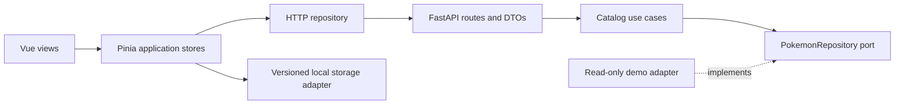

# PokeShop

[English](README.md) · [Español](README.es.md)

A Pokémon shop demo built with Vue 3, TypeScript and FastAPI. Explore a Kanto
catalog, filter by name, Pokédex number or type, inspect a Pokémon and keep a
cart across browser reloads. No accounts, checkout or real payments yet.

## Run locally with Docker

Requires Docker Desktop with Linux containers and Docker Compose v2.

```sh
docker compose up --build --wait
```

- Frontend: http://localhost:5173
- API documentation: http://localhost:8000/docs
- API health: http://localhost:8000/health

If a port is occupied, copy `.env.example` to `.env` at the repository root and
change `FRONTEND_PORT` or `BACKEND_PORT`. CORS follows the frontend port.
The `.env` file is ignored by Git. Source edits reload automatically, including
on Windows/WSL. Vue dependencies live in a separate Linux volume.

## What is implemented

- Twelve demo Pokémon with artwork, types, descriptions, fictional EUR prices
  and availability. The catalog is served by FastAPI, not embedded in the UI.
- Search by name or number (`#025`), type filters and sorting by price/name/number.
- Product detail routes, stock-aware cart controls, integer-cent totals and empty states.
- Versioned local storage containing only IDs and quantities. Restored quantities
  are reconciled with catalog stock; prices always come from the current catalog.
- Loading, API failure/retry, missing product/page and image fallback states.
- Responsive desktop/mobile layout, labeled controls, keyboard focus and reduced motion.

The catalog uses a **read-only demo repository** with deterministic data. PostgreSQL
and Redis are available in Compose but are not used by the catalog yet. There are
no models, migrations, automatic seeds, stock reservations or order endpoints.
The cart is local to a browser; it is not an authoritative order or stock reservation.

## Architecture



Backend domain entities and repository ports do not depend on FastAPI. Application
use cases implement filtering and pagination; the presentation adapter composes
the demo repository and validates the HTTP contract. On the frontend, domain types,
filtering/cart logic, HTTP/storage adapters and Vue views are separated by context.
The frontend loads the small demo catalog once and filters it locally; the API also
supports server-side filtering and pagination for a future larger catalog.

```text
backend/src/pokemon/{domain,application,infrastructure,presentation}
frontend/src/pokemon/{domain,application,infrastructure,presentation}
frontend/src/cart/{domain,application,infrastructure,presentation}
frontend/src/shared/presentation/  # formatting
```

The `user` contexts remain placeholders for a later accounts feature.

## Stack and resources

Python 3.12 / Poetry 2.1.3; Vue 3 / TypeScript / Vite 7 / Pinia / Vue Router /
Tailwind CSS 4; Node 22 / pnpm 10.10.0. Both dependency lockfiles are committed.

| Container | Memory limit |
| --- | --- |
| Frontend | 1 GiB |
| Backend | 512 MiB |
| PostgreSQL 16 | 256 MiB |
| Redis 7 | 128 MiB |

Total: **1,920 MiB**, without additional container swap. Redis limits cached data
to 64 MiB with LRU eviction. These limits exclude Docker Desktop and image builds.
See [development resources](docs/development.md). Only web ports are published,
bound to localhost. Database/cache data persist in named volumes.

## Commands and verification

```sh
docker compose ps
docker stats --no-stream
docker compose logs -f

docker compose exec frontend pnpm build
docker compose exec frontend pnpm test:unit --run
docker compose exec frontend pnpm exec eslint .
docker compose exec backend python -m unittest discover -s tests -v

docker compose exec frontend pnpm add <package>
docker compose up --build --wait

# Stop without deleting data
docker compose down
```

Verified: 9 backend tests, 7 frontend unit tests, type checking, production build,
ESLint and browser checks for search, filtering, detail, cart quantities and reload
persistence. Desktop and mobile layouts were inspected in the browser.
A Playwright regression scenario is included under `frontend/e2e`; running it
requires installed browser binaries (see the frontend README).

Local setup without Docker: [frontend](frontend/README.md), [backend](backend/README.md).
For local frontend use, set `API_PROXY_TARGET` if the API is not on port 8000.

## Scope and attribution

Compose runs development servers; no production deployment is configured.
`docker compose down -v` deletes database, Redis and frontend dependency volumes.

Artwork is loaded from [PokéAPI sprites](https://github.com/PokeAPI/sprites) and
requires network access; catalog data does not depend on the external PokéAPI service.
Pokémon and character artwork belong to their respective rights holders.
This is an independent educational demo with fictional prices and stock.
