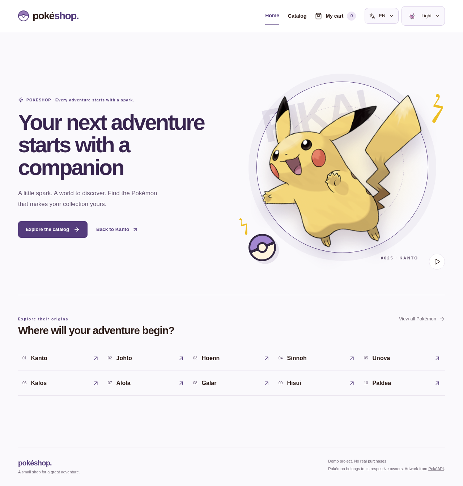
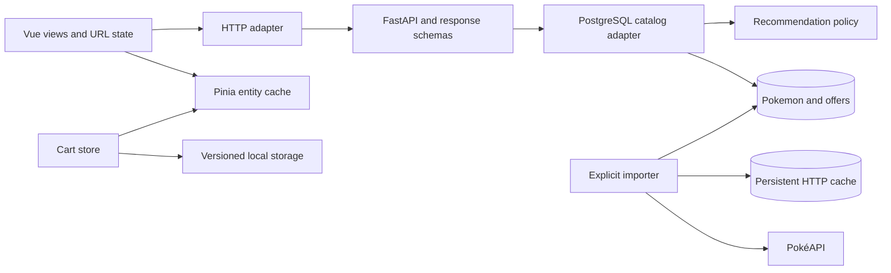

# PokeShop

[English](README.md) · [Español](README.es.md)


A Pokémon shop demo with a 2D animated Pikachu home, a complete imported catalog, and a persistent cart. Built with Vue 3, TypeScript and FastAPI. Prices and stock are fictional; accounts, payments and real orders are outside this phase.

[Local demo](http://localhost:5173) · [API documentation](http://localhost:8000/docs)

[](docs/home.png)

[Catalog preview](docs/catalog.png) · [Cart preview](docs/cart.png)

## Highlights

- `/`: an asymmetric Pikachu scene, pause control and region shortcuts. Animation stops offscreen, in hidden tabs and with reduced motion.
- `/catalogo`: all 24 results use a height-based CSS Grid bento (≤1 m: 2×1; ≤2 m: 3×1; >2 m: 3×2 on six desktop columns), retaining sorted order. Two columns on tablet, one on mobile. A draft filter drawer contains type, origin region, generation, form and ordering; Apply updates the URL and resets pagination, Cancel discards edits.
- `/pokemon/:id`: localized biology, dimensions, origin and abilities. Base statistics open on hover/keyboard focus or tap; clicking pins the popover, Escape/outside/close dismiss it.
- `/carrito`: IDs and quantities persist across reloads. Entity storage is independent from catalog pages; failed requests never erase the selection or imply unavailable stock.
- Four available recommendations prioritize shared types, then generation, then price proximity. Species are unique and species already selected are excluded. An empty cart shows featured Pokémon.
- Spanish/English through Vue I18n, accessible Reka UI selects, Lucide icons, light/dark/system themes, and a 700 ms circular manual theme transition. Reduced motion and automatic system changes skip animation; unsupported browsers transition colors for 300 ms without fading the page.

Chansey accompanies the cart summary and empty state. Action notices expire after three seconds, pause on hover/focus and restart with each action. Storage errors remain visible. Espeon and Umbreon identify the light and dark themes.

## Run locally

Requires Docker Desktop with Linux containers and Compose v2.

```sh
cp .env.example .env
# Set POSTGRES_PASSWORD in .env before starting
docker compose up --build --wait
docker compose exec backend alembic upgrade head
docker compose exec backend python -m src.pokemon.infrastructure.sync
```

Open http://localhost:5173. API health: http://localhost:8000/health.
If a port is occupied, edit `.env` and set `FRONTEND_PORT` or `BACKEND_PORT`. The development workspace uses `FRONTEND_PORT=5174`; this local override is not committed. CORS follows the configured port.

Source changes reload automatically, including on Windows/WSL. Frontend dependencies live in a Linux volume and use **pnpm only**. The first import needs internet access; subsequent shop navigation reads PostgreSQL. Illustrations remain remote.

## Importing and updating data

The explicit importer follows all pages of PokéAPI's `/pokemon` endpoint. The first verified import on 2026-09-07 contained **1,351 entries across nine species generations**. This is an observed upstream count, not a hard-coded limit.

Each distinct `/pokemon` resource is one product, including its alternative forms. No additional products are generated from cosmetic `/pokemon-form` records or shiny sprites. Entry IDs identify routes and cart lines; `species_id` is the displayed national Pokédex number. A form's generation is its **species generation**, not the generation in which the form appeared.

The importer stores Spanish/English names, available species descriptions, form names, localized abilities and base stats. Source hectograms and decimetres become kilograms and metres. Where a description is missing in the selected language, the UI composes a factual localized description from type, weight and height.

```sh
# Resume/repeat using the persistent PostgreSQL HTTP cache
docker compose exec backend python -m src.pokemon.infrastructure.sync
# Explicitly refresh upstream responses (including resource lists)
docker compose exec backend python -m src.pokemon.infrastructure.sync --refresh
```

At most four HTTP requests run concurrently, with three attempts per resource and bounded backoff. Each complete product commits independently. Failures are reported with a nonzero exit status; already imported rows remain. Rerunning after interruption reuses cached resources and upserts biological data. The importer does not delete absent upstream entries.

`pokemon` stores biology; `offers` stores base cents, price, stock, policy version and its calculation breakdown. All 1,351 offers were repriced with `classic-v1`, preserving stock. New products receive the current policy and 10 fictional units; later biological syncs preserve existing offers. `api_cache` persists upstream responses in PostgreSQL.

## Regions and fictional pricing

Region denotes species/form origin, not every place where it can be found. The generation's main region is the default; Alola/Galar/Hisui/Paldea forms override it. Wyrdeer, Kleavor, Ursaluna, Basculegion, Sneasler, Overqwil and Enamorus explicitly originate in Hisui. Evolution stage is the depth in the species chain (root = 1); Mega/Gigantamax inherit the species stage.

```text
price = €30 × (1 + .05 × weight_kg) × (1 + .10 × (stage − 1)) × generation factor × region factor
```

Generation 1–9 factors: 1.80, 1.70, 1.60, 1.50, 1.40, 1.30, 1.20, 1.10, 1.00. Region factors: Kanto 1.45, Johto 1.40, Hoenn 1.35, Sinnoh 1.30, Unova 1.25, Kalos 1.20, Alola 1.15, Galar 1.10, Hisui 1.05, Paldea 1.00. Weight is clamped to 0–1,000 kg. Missing weight/stage use 0/1 and unknown factors use 1, reported in the preview. Decimal arithmetic rounds to the nearest €0.10 (half up). Pokédex number has no effect.

Verified examples: Bulbasaur €105.30, Metapod €128.80, Charizard €519.10, Venusaur €563.80. These are fictional collection prices, not market valuations.

```sh
# Preview only (default)
docker compose exec backend python -m src.pokemon.infrastructure.reprice
# Apply all prices atomically; stock is unchanged
docker compose exec backend python -m src.pokemon.infrastructure.reprice --apply
```

The ignored root `.env` holds `POSTGRES_PASSWORD`; both services reference it. API, Alembic and importer share `src/database.py`, using SQLAlchemy URL construction for special characters. A fully encoded `DATABASE_URL` is an optional backend-only override. No database credential enters the frontend; browser requests use `/api`. Existing database passwords and volumes must be retained when migrating configuration.

## API

| Endpoint | Behavior |
| --- | --- |
| `GET /api/v1/pokemon` | `{ items, total }`; `q`, `type`, `region`, `generation`, `forms=all/default/alternative`, `sort`, `limit` (default 24, maximum 100), `offset` |
| `/api/v1/pokemon/{id}` | Expanded product; 404 when absent |
| `/api/v1/pokemon/metadata` | Available types, generations and localized regions |
| `/api/v1/pokemon/featured` | Editorial selection |
| `/api/v1/pokemon/batch?ids=25,10100` | Up to 100 entry IDs, for cart hydration |
| `/api/v1/pokemon/recommendations?ids=25` | Four available, distinct-species suggestions with a reason |

Sorting values: `number`, `name`, `price_asc`, `price_desc`, `weight_asc`, `weight_desc`, `height_asc`, `height_desc`. Numeric searches match species IDs and therefore include that species' alternative forms. Existing response fields are retained; the complete typed contract is in `/docs`.

## Architecture and decisions



Filtering, counts and pagination run in PostgreSQL. Recommendation ranking is a storage-independent application policy. Flexible multilingual biological metadata lives in JSONB; constrained commercial offers are separate. The old deterministic demo adapter remains only for isolated API tests; it is not the runtime catalog. Redis is provisioned but unused by this catalog.

```text
backend/migrations/                     # Alembic schema versions
backend/src/pokemon/application/        # Catalog and recommendation policies
backend/src/pokemon/infrastructure/     # PostgreSQL adapter and resumable importer
backend/src/pokemon/presentation/       # Routes and typed schemas
frontend/src/pokemon/                   # Entities, HTTP, home/catalog/detail
frontend/src/cart/                      # Persistent selection and presentation
frontend/src/shared/                    # Formatting, theme and preferences
frontend/src/i18n/                      # English/Spanish UI dictionaries
frontend/e2e/                           # Browser regressions and responsive captures
```

## Stack and memory limits

Python 3.12, Poetry 2.1.3, FastAPI, SQLAlchemy/asyncpg, Alembic; Vue 3, TypeScript, Vite 7, Pinia, Vue Router, Vue I18n 11, Reka UI, Lucide, Tailwind CSS 4; Node 22 and pnpm 10.10.0. Both dependency lockfiles are committed.

| Container | Memory limit |
| --- | --- |
| Frontend | 2 GiB |
| Backend (including importer) | 512 MiB |
| PostgreSQL 16 | 256 MiB |
| Redis 7 | 128 MiB |

Total: **2,944 MiB**, without additional container swap. Redis data is capped at 64 MiB with LRU eviction. Limits exclude Docker Desktop and image builds. Only web ports are exposed, bound to localhost. See [resource details](docs/development.md).

## Verification and commands

Run resource-intensive checks sequentially:

```sh
docker compose exec backend python -m unittest discover -s tests -v
docker compose exec frontend pnpm test:unit --run
docker compose exec frontend pnpm type-check
docker compose exec frontend pnpm exec eslint .
docker compose exec frontend pnpm build-only

# Install Chromium once in the current dev container, then run browser tests
docker compose exec frontend pnpm exec playwright install --with-deps chromium
docker compose exec frontend pnpm test:e2e

docker compose ps
docker stats --no-stream
docker compose logs -f
# Preserve volumes when stopping
docker compose down
```

Verified on 2026-09-07: 21 backend tests and 18 frontend unit tests; type checks, ESLint, production build and Ruff. The full Chromium suite passed against the production preview; core interactions were also checked against the development server. Browser coverage comprises five interaction regressions and 20 responsive scenarios, each visiting all four routes at 320/375/414/768/1280 px in Spanish/English and light/dark (80 captures). The suite checks successful loading and horizontal overflow; screenshots are generated under the ignored `frontend/test-results/` directory for visual review. Keyboard selection, Escape/focus restoration, cart paging/reload/network recovery and preference persistence are covered. Import repeat, controlled interruption and successful recovery were also exercised.

Integration tests require the migration and initial sync above. Browser tests use Chromium and the running dev server; set `PLAYWRIGHT_BASE_URL` for an external server. Other browser engines are not verified. `pnpm build` also runs type checking and bundling sequentially.

## Scope and attribution

This Compose stack uses development servers. No production deployment, accounts, reservations, real checkout or payments are configured. The browser cart is not an authoritative order. `docker compose down -v` deletes local database, Redis and frontend dependency volumes.

Data: [PokéAPI](https://pokeapi.co/docs/v2). Artwork: [PokéAPI sprites](https://github.com/PokeAPI/sprites). Pokémon and character artwork belong to their respective rights holders. This is an independent educational demo.
