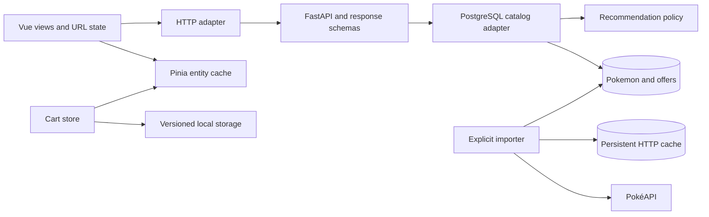

# PokeShop

[English](README.md) · [Español](README.es.md)


A Pokémon shop demo with a weight-based promotional home, a complete imported catalog, and a persistent cart. Built with Vue 3, TypeScript and FastAPI. Prices and stock are fictional; accounts, payments and real orders are outside this phase.

[Local demo](http://localhost:5173) · [API documentation](http://localhost:8000/docs)

[](docs/home.png)

## Highlights

- `/`: six featured Pokémon in a bento whose sizes represent real weight categories: light ≤ 10 kg, medium ≤ 100 kg and heavy > 100 kg. Generation shortcuts link to filtered catalogs.
- `/catalogo`: server-side search, type/generation/form filters, number/name/price/weight ordering, and pages of 24. Filters and page live in the URL; obsolete requests are cancelled.
- `/pokemon/:id`: species number, distinct form name, localized description, kg/metres, abilities and six labelled base statistics.
- `/carrito`: IDs and quantities persist across reloads. Entity storage is independent from catalog pages; failed requests never erase the selection or imply unavailable stock.
- Four available recommendations prioritize shared types, then generation, then price proximity. Species are unique and species already selected are excluded. An empty cart shows featured Pokémon.
- Spanish/English through Vue I18n, accessible Reka UI selects, Lucide icons, light/dark/system themes, and a 350 ms circular manual theme transition. Reduced motion and automatic system changes skip animation; unsupported browsers use a brief fade.

## Run locally

Requires Docker Desktop with Linux containers and Compose v2.

```sh
docker compose up --build --wait
docker compose exec backend alembic upgrade head
docker compose exec backend python -m src.pokemon.infrastructure.sync
```

Open http://localhost:5173. API health: http://localhost:8000/health.
If a port is occupied, copy `.env.example` to `.env` and set `FRONTEND_PORT` or `BACKEND_PORT`. The development workspace uses `FRONTEND_PORT=5174`; this local override is not committed. CORS follows the configured port.

Source changes reload automatically, including on Windows/WSL. Frontend dependencies live in a Linux volume and use **pnpm only**. The first import needs internet access; subsequent shop navigation reads PostgreSQL. Illustrations remain remote.

## Importing and updating data

The explicit importer follows all pages of PokéAPI's `/pokemon` endpoint. The first verified import on 2026-09-07 contained **1,351 entries across nine species generations**. This is an observed upstream count, not a hard-coded limit.

Each distinct `/pokemon` resource is one product, including its alternative forms. No additional products are generated from cosmetic `/pokemon-form` records or shiny sprites. Entry IDs identify routes and cart lines; `species_id` is the displayed national Pokédex number. A form's generation is its **species generation**, not the generation in which the form appeared.

The importer stores Spanish/English names, available species descriptions, form names, localized abilities and base stats. Source hectograms and decimetres become kilograms and metres. Where a description is missing in the selected language, the UI composes a factual localized description from type, weight and height.

```sh
# Resume/repeat using the persistent PostgreSQL HTTP cache
docker compose exec backend python -m src.pokemon.infrastructure.sync
# Explicitly refresh upstream responses (including resource lists)
docker compose exec backend python -m src.pokemon.infrastructure.sync --refresh
```

At most four HTTP requests run concurrently, with three attempts per resource and bounded backoff. Each complete product commits independently. Failures are reported with a nonzero exit status; already imported rows remain. Rerunning after interruption reuses cached resources and upserts biological data. The importer does not delete absent upstream entries.

`pokemon` stores biological data; `offers` stores commercial values. The original 12 prices and stocks are preserved. New offers start at **€29.90 and 10 fictional units**; synchronization never overwrites existing offers. `api_cache` persists HTTP responses with timestamps in the database volume. Run the importer inside the existing backend container, as shown above.

## API

| Endpoint | Behavior |
| --- | --- |
| `GET /api/v1/pokemon` | `{ items, total }`; `q`, `type`, `generation`, `forms=all/default/alternative`, `sort`, `limit` (default 24, maximum 100), `offset` |
| `/api/v1/pokemon/{id}` | Expanded product; 404 when absent |
| `/api/v1/pokemon/metadata` | Available types and generations |
| `/api/v1/pokemon/featured` | Editorial selection |
| `/api/v1/pokemon/batch?ids=25,10100` | Up to 100 entry IDs, for cart hydration |
| `/api/v1/pokemon/recommendations?ids=25` | Four available, distinct-species suggestions with a reason |

Sorting values: `number`, `name`, `price_asc`, `price_desc`, `weight_asc`, `weight_desc`. Numeric searches match species IDs and therefore include that species' alternative forms. Existing response fields are retained; the complete typed contract is in `/docs`.

## Architecture and decisions



Filtering, counts and pagination run in PostgreSQL. Recommendation ranking is a storage-independent application policy. Flexible multilingual biological metadata lives in JSONB; constrained commercial offers are separate. The old deterministic demo adapter remains only for isolated API tests and the original offer defaults; it is not the runtime catalog. Redis is provisioned but unused by this catalog.

```text
backend/migrations/                     # Alembic schema versions
backend/src/pokemon/application/        # Catalog and recommendation policies
backend/src/pokemon/infrastructure/     # PostgreSQL adapter and resumable importer
backend/src/pokemon/presentation/       # Routes and typed schemas
frontend/src/pokemon/                   # Entities, HTTP, home/catalog/detail
frontend/src/cart/                      # Persistent selection and presentation
frontend/src/shared/                    # Formatting, theme and preferences
frontend/src/i18n/                      # English/Spanish UI dictionaries
frontend/e2e/                           # Browser regressions and responsive captures
```

## Stack and memory limits

Python 3.12, Poetry 2.1.3, FastAPI, SQLAlchemy/asyncpg, Alembic; Vue 3, TypeScript, Vite 7, Pinia, Vue Router, Vue I18n 11, Reka UI, Lucide, Tailwind CSS 4; Node 22 and pnpm 10.10.0. Both dependency lockfiles are committed.

| Container | Memory limit |
| --- | --- |
| Frontend | 1 GiB |
| Backend (including importer) | 512 MiB |
| PostgreSQL 16 | 256 MiB |
| Redis 7 | 128 MiB |

Total: **1,920 MiB**, without additional container swap. Redis data is capped at 64 MiB with LRU eviction. Limits exclude Docker Desktop and image builds. Only web ports are exposed, bound to localhost. See [resource details](docs/development.md).

## Verification and commands

Run resource-intensive checks sequentially:

```sh
docker compose exec backend python -m unittest discover -s tests -v
docker compose exec frontend pnpm test:unit --run
docker compose exec frontend pnpm type-check
docker compose exec frontend pnpm exec eslint .
docker compose exec frontend pnpm build-only

# Install Chromium once in the current dev container, then run browser tests
docker compose exec frontend pnpm exec playwright install --with-deps chromium
docker compose exec frontend pnpm test:e2e

docker compose ps
docker stats --no-stream
docker compose logs -f
# Preserve volumes when stopping
docker compose down
```

Verified on 2026-09-07: 12 backend tests and 17 frontend unit tests; type checks, ESLint, production build and Ruff. Chromium passed against both the development server and the production preview. Browser coverage comprises two interaction regressions and 20 responsive scenarios, each visiting all four routes at 320/375/414/768/1280 px in Spanish/English and light/dark (80 captures). The suite checks successful loading and horizontal overflow; screenshots are generated under the ignored `frontend/test-results/` directory for visual review. Keyboard selection, Escape/focus restoration, cart paging/reload/network recovery and preference persistence are covered. Import repeat, controlled interruption and successful recovery were also exercised.

Integration tests require the migration and initial sync above. Browser tests use Chromium and the running dev server; set `PLAYWRIGHT_BASE_URL` for an external server. Other browser engines are not verified. `pnpm build` also runs type checking and bundling sequentially.

## Scope and attribution

This Compose stack uses development servers. No production deployment, accounts, reservations, real checkout or payments are configured. The browser cart is not an authoritative order. `docker compose down -v` deletes local database, Redis and frontend dependency volumes.

Data: [PokéAPI](https://pokeapi.co/docs/v2). Artwork: [PokéAPI sprites](https://github.com/PokeAPI/sprites). Pokémon and character artwork belong to their respective rights holders. This is an independent educational demo.
