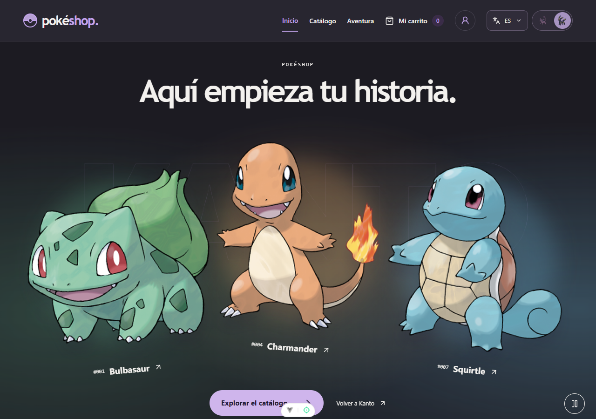
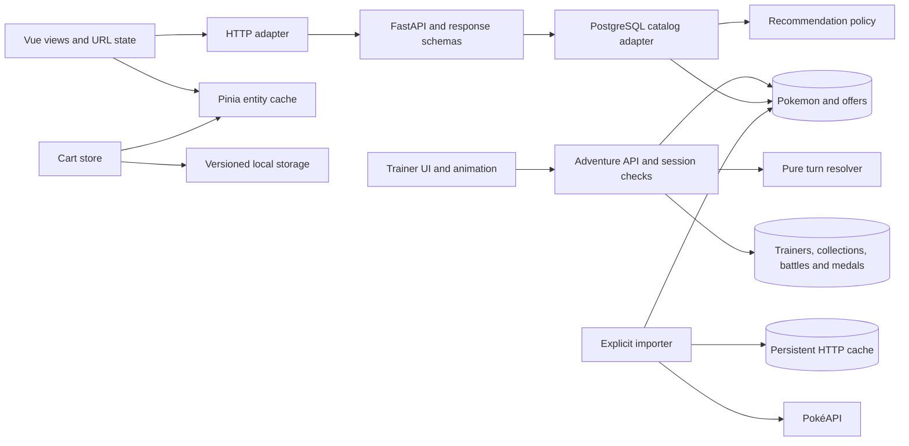

# PokeShop

[English](README.md) · [Español](README.es.md)


A Pokémon shop demo with a full-width Kanto starter collage, a complete imported catalog, a persistent demonstration cart, and an invitation-only trainer adventure. Build a team with fictional credits and challenge six gym leaders in server-controlled turn-based battles. Built with Vue 3, TypeScript and FastAPI; no real payments or orders.

[Repository](https://github.com/kevin0018/PokeShop) · [Live demo](https://pokeshop-app.duckdns.org) · [Local API documentation](http://localhost:8000/docs)

[](docs/home.png)

[Catalog preview](docs/catalog.png) · [Trainer catalog](docs/catalog-trainer.png) · [Cart preview](docs/cart.png) · [Adventure battle](docs/adventure.png) · [Mobile battle](docs/adventure-mobile.png)

[Pokémon Center](docs/center.png) · [Collection PC](docs/collection-pc.png) · [Gym leaders](docs/gyms.png)

## Highlights

- `/aventura`: invitation-only accounts with 1,000 fictional starting credits. Build and save a team in a Pokémon Center, open its pixel-art PC to browse 30-slot collection boxes, and sell Pokémon with a confirmed refund. Six sequential gyms use leader portraits and type colors. Battles open with two black wipes and become the only focus: navigation and footer disappear, the gym scenery fills the viewport, and the turn indicator opens persistent history grouped by turn and actor. Server-controlled purchases, turns and rewards survive reloads. [Rules, access, deployment and tests](docs/adventure.md).
- `/`: a full-width collage of Bulbasaur, Charmander and Squirtle, without a card frame. Shared type colors shape the background; catalog and Kanto links remain. The homepage opens directly. Reduced motion disables decorative animation; the background stops offscreen and in hidden tabs.
- `/catalogo`: a blue-striped shop front and pixel-art counter lead into an ordered bento catalog: one large card, two horizontal cards and three small cards per complete block. Tablet uses two columns and mobile one; partial blocks preserve order without overlap. Signed-in trainers see their balance, credit prices and the 26 battle-ready Kanto Pokémon by default. Purchases go through the existing cart. Search and filters retain URL state and explicit Apply/Cancel.
- `/pokemon/:id`: localized biology, dimensions and origin. Statistics open from the top-right corner of the illustration on hover, keyboard focus or tap; click pins the popover and Escape/outside/close dismiss it. Abilities remain in the API but are omitted from the view.
- `/carrito`: six distinct products per page, with totals calculated over the complete cart. Removing the final item on a page selects the last valid page; quantity changes retain the page. IDs and quantities persist, independently of catalog pagination and network failures. Signed-in trainers confirm an atomic checkout validated by the server; durable receipts prevent repeat charges after a lost response. Anonymous visitors keep the euro-priced demonstration cart.
- Four available recommendations prioritize shared types, then generation, then price proximity. Species are unique and species already selected are excluded. An empty cart shows featured Pokémon.
- Spanish/English through Vue I18n, accessible Reka UI selects, Lucide icons, light/dark themes with browser-default detection, and a 700 ms circular manual theme transition. Reduced motion and automatic system changes skip animation; unsupported browsers transition colors for 300 ms without fading the page. The light theme uses cream surfaces; dark uses violet graphite with the original purple accent. The homepage retains the green/orange/blue backgrounds of the three starters.

Chansey appears at 180–240 px depending on the viewport below the receipt-style summary on desktop and mobile, and accompanies the empty state. Three-second notices use a disappearing pie indicator, pause on hover/focus and restart with each action. Storage errors remain visible. An animated Espeon/Umbreon switch selects light/dark, using the browser preference initially and remembering manual selections. The existing 700 ms page reveal is preserved.

The header previews the three most recently added distinct products and the complete cart total on hover, keyboard focus, click or tap. “View full cart” opens the list; “Empty cart” clears the saved selection. Recent order persists without rearranging cart pages.

Type colors are shared across catalog cards, detail artwork, cart thumbnails and cart preview. The receipt takes a subtle tint from the most recently added product.

## Run locally

Requires Docker Desktop with Linux containers and Compose v2.

```sh
cp .env.example .env
# Set POSTGRES_PASSWORD in .env before starting
docker compose up --build --wait
docker compose exec backend alembic upgrade head
docker compose exec backend python -m src.pokemon.infrastructure.sync
```

Open http://localhost:5173. API health: http://localhost:8000/health.
If a port is occupied, edit `.env` and set `FRONTEND_PORT` or `BACKEND_PORT`. The development workspace uses `FRONTEND_PORT=5174`; this local override is not committed. CORS follows the configured port.

Source changes reload automatically, including on Windows/WSL. Frontend dependencies live in a Linux volume and use **pnpm only**. The first import needs internet access; subsequent shop navigation reads PostgreSQL. Illustrations remain remote.

## Importing and updating data

The explicit importer follows all pages of PokéAPI's `/pokemon` endpoint. The first verified import on 2026-09-07 contained **1,351 entries across nine species generations**. This is an observed upstream count, not a hard-coded limit.

Each distinct `/pokemon` resource is one product, including its alternative forms. No additional products are generated from cosmetic `/pokemon-form` records or shiny sprites. Entry IDs identify routes and cart lines; `species_id` is the displayed national Pokédex number. A form's generation is its **species generation**, not the generation in which the form appeared.

The importer stores Spanish/English names, available species descriptions, form names, localized abilities and base stats. Source hectograms and decimetres become kilograms and metres. Where a description is missing in the selected language, the UI composes a factual localized description from type, weight and height.

```sh
# Resume/repeat using the persistent PostgreSQL HTTP cache
docker compose exec backend python -m src.pokemon.infrastructure.sync
# Explicitly refresh upstream responses (including resource lists)
docker compose exec backend python -m src.pokemon.infrastructure.sync --refresh
```

At most four HTTP requests run concurrently, with three attempts per resource and bounded backoff. Each complete product commits independently. Failures are reported with a nonzero exit status; already imported rows remain. Rerunning after interruption reuses cached resources and upserts biological data. The importer does not delete absent upstream entries.

`pokemon` stores biology; `offers` stores base cents, price, stock, policy version and its calculation breakdown. All 1,351 offers were repriced with `classic-v1`, preserving stock. New products receive the current policy and 10 fictional units; later biological syncs preserve existing offers. `api_cache` persists upstream responses in PostgreSQL.

## Regions and fictional pricing

Region denotes species/form origin, not every place where it can be found. The generation's main region is the default; Alola/Galar/Hisui/Paldea forms override it. Wyrdeer, Kleavor, Ursaluna, Basculegion, Sneasler, Overqwil and Enamorus explicitly originate in Hisui. Evolution stage is the depth in the species chain (root = 1); Mega/Gigantamax inherit the species stage.

```text
price = €30 × (1 + .05 × weight_kg) × (1 + .10 × (stage − 1)) × generation factor × region factor
```

Generation 1–9 factors: 1.80, 1.70, 1.60, 1.50, 1.40, 1.30, 1.20, 1.10, 1.00. Region factors: Kanto 1.45, Johto 1.40, Hoenn 1.35, Sinnoh 1.30, Unova 1.25, Kalos 1.20, Alola 1.15, Galar 1.10, Hisui 1.05, Paldea 1.00. Weight is clamped to 0–1,000 kg. Missing weight/stage use 0/1 and unknown factors use 1, reported in the preview. Decimal arithmetic rounds to the nearest €0.10 (half up). Pokédex number has no effect.

Verified examples: Bulbasaur €105.30, Metapod €128.80, Charizard €519.10, Venusaur €563.80. These are fictional collection prices, not market valuations.

```sh
# Preview only (default)
docker compose exec backend python -m src.pokemon.infrastructure.reprice
# Apply all prices atomically; stock is unchanged
docker compose exec backend python -m src.pokemon.infrastructure.reprice --apply
```

The ignored root `.env` holds `POSTGRES_PASSWORD`; both services reference it. API, Alembic and importer share `src/database.py`, using SQLAlchemy URL construction for special characters. A fully encoded `DATABASE_URL` is an optional backend-only override. No database credential enters the frontend; browser requests use `/api`. Existing database passwords and volumes must be retained when migrating configuration.

## API

| Endpoint | Behavior |
| --- | --- |
| `GET /api/v1/pokemon` | `{ items, total }`; `q`, `type`, `region`, `generation`, `forms=all/default/alternative`, `sort`, `currency=credits`, `playable=true`, `limit` (default 24, maximum 100), `offset` |
| `/api/v1/pokemon/{id}` | Expanded product; 404 when absent |
| `/api/v1/pokemon/metadata` | Available types, generations and localized regions |
| `/api/v1/pokemon/featured` | Editorial selection |
| `/api/v1/pokemon/batch?ids=25,10100` | Up to 100 entry IDs, for cart hydration |
| `/api/v1/pokemon/recommendations?ids=25` | Four available, distinct-species suggestions with a reason |

Sorting values: `number`, `name`, `price_asc`, `price_desc`, `weight_asc`, `weight_desc`, `height_asc`, `height_desc`. Numeric searches match species IDs and therefore include that species' alternative forms. Existing response fields are retained; the complete typed contract is in `/docs`.

Adventure endpoints are documented in [the adventure guide](docs/adventure.md) and `/docs`: registration/login/logout, current trainer, shop, team, checkout, sales and battle creation/read/turns. Authentication and ownership are enforced by the API.

## Architecture and decisions


```mermaid
flowchart LR
  Views[Vue views and URL state] --> HTTP[HTTP adapter]
  Views --> Entities[Pinia entity cache]
  Cart[Cart store] --> Entities
  Cart --> Storage[Versioned local storage]
  HTTP --> API[FastAPI and response schemas]
  API --> PG[PostgreSQL catalog adapter]
  Trainer[Trainer UI and animation] --> Game[Adventure API and session checks]
  Game --> Rules[Pure turn resolver]
  Game --> GameDB[(Trainers, collections, battles and medals)]
  Game --> DB
  PG --> Policy[Recommendation policy]
  PG --> DB[(Pokemon and offers)]
  Sync[Explicit importer] --> Cache[(Persistent HTTP cache)]
  Sync --> PokeAPI[PokéAPI]
  Sync --> DB
```

Filtering, counts and pagination run in PostgreSQL. Recommendation ranking is a storage-independent application policy. Flexible multilingual biological metadata lives in JSONB; constrained commercial offers are separate. The old deterministic demo adapter remains only for isolated API tests; it is not the runtime catalog. Redis is provisioned but unused by this catalog.

```text
backend/migrations/                     # Alembic schema versions
backend/src/adventure/                  # Sessions, transactional game service and turn rules
backend/src/pokemon/application/        # Catalog and recommendation policies
backend/src/pokemon/infrastructure/     # PostgreSQL adapter and resumable importer
backend/src/pokemon/presentation/       # Routes and typed schemas
frontend/src/pokemon/                   # Entities, HTTP, home/catalog/detail
frontend/src/adventure/                 # Trainer views, API state and sprite animations
frontend/src/cart/                      # Persistent selection and presentation
frontend/src/shared/                    # Formatting, theme and preferences
frontend/src/i18n/                      # English/Spanish UI dictionaries
frontend/e2e/                           # Browser regressions and responsive captures
```

## Stack and memory limits

Python 3.12, Poetry 2.1.3, FastAPI, SQLAlchemy/asyncpg, Alembic; Vue 3, TypeScript, Vite 7, Pinia, Vue Router, Vue I18n 11, Reka UI, Lucide, Tailwind CSS 4; Node 22 and pnpm 10.10.0. Both dependency lockfiles are committed. Redis is available in Compose but is not used by the catalog. Declared legacy dependencies such as Stripe do not imply implemented payment features.

| Container | Memory limit |
| --- | --- |
| Frontend | 2 GiB |
| Backend (including importer) | 512 MiB |
| PostgreSQL 16 | 256 MiB |
| Redis 7 | 128 MiB |

Total: **2,944 MiB**, without additional container swap. Redis data is capped at 64 MiB with LRU eviction. Limits exclude Docker Desktop and image builds. Only web ports are exposed, bound to localhost. See [resource details](docs/development.md).

## Verification and commands

Run resource-intensive checks sequentially:

```sh
docker compose exec backend python -m unittest tests.test_app tests.test_catalog tests.test_database_config tests.test_pricing tests.test_persistent_catalog -v
docker compose exec frontend pnpm test:unit --run
docker compose exec frontend pnpm type-check
docker compose exec frontend pnpm exec eslint .
docker compose exec frontend pnpm build-only

# Install Chromium once in the current dev container, then run browser tests
docker compose exec frontend pnpm exec playwright install --with-deps chromium
docker compose exec frontend pnpm test:e2e

docker compose ps
docker stats --no-stream
docker compose logs -f
# Preserve volumes when stopping
docker compose down
```

Local verification on 2026-10-03 includes 25 adventure tests, 22 existing backend regressions and 19 frontend unit tests. The 33-test catalog/cart/browser suite passed during the redesign; targeted checks were repeated after subsequent presentation changes. The final adventure browser run checks registration, credit checkout, PC boxes and sales, team persistence, sequential gym progress, lost-response recovery, battle history, the entry transition and restoration of navigation after battle. Type checking, ESLint and production builds passed.

Browser coverage includes Spanish/English and light/dark at 320/375/414/768/1280 px, checking loading and horizontal overflow. Captures under `frontend/test-results/` are ignored; the curated images in `docs/` show the local interface, not proof of the currently deployed release.

Adventure tests clear and seed game tables: run them only against a separate database named `adventure_test_<suffix>`. The adventure browser test needs a disposable preview database and a fresh single-use invitation; without `PLAYWRIGHT_ADVENTURE_CODE` it is skipped. See [isolated test setup](docs/adventure.md#verification). Existing integration tests require the migration and catalog sync above. Set `PLAYWRIGHT_BASE_URL` to target another running frontend, and optionally `PLAYWRIGHT_CHANNEL=chrome` to use installed Chrome. Other browser engines are not verified.

The public VPS was last fully verified on 2026-09-07 with 33 browser tests. That historical check does not establish that the latest adventure and design changes are deployed. Checks are manual; there is no hosted CI/CD.

## Deployment

**Live on the Contabo VPS: [https://pokeshop-app.duckdns.org](https://pokeshop-app.duckdns.org). HTTPS is enabled with automatic certificate renewal.**

HTTP requests to the domain or server IP redirect to the HTTPS domain. Certificate renewal was verified with a successful Certbot dry run; three targeted Chromium regressions also passed over HTTPS (catalog/cart recovery, language/theme persistence and cart preview). Browser carts are stored per origin, so a cart saved on localhost or the IP does not transfer to the domain.

The standalone `compose.production.yaml` serves the compiled Vue frontend with Nginx and runs FastAPI without reload. Host Nginx forwards to a loopback-only port; `/api` stays on the same origin, and Vue deep links fall back to `index.html`. PostgreSQL and the API expose no host ports. The existing website remains running.

Production containers are capped at 896 MiB total (frontend 128, API 512, PostgreSQL 256), with no additional swap. The unused Redis service is omitted. Development Compose and its limits remain unchanged.

The initial deployment transferred all 1,351 products, offers and cached upstream data, preserving prices and stock. Secrets live only in a private server environment file. See the [deployment runbook](docs/deployment.md) for paths, release commands, migrations, backups and verification. Scheduled off-server backups and CI/CD remain pending; GitHub pushes do not deploy automatically.

## Scope and attribution

The default Compose stack uses development servers; production uses the separate configuration above. Trainer accounts and fictional-credit purchases belong to the invitation-only adventure. There are no shared-stock reservations, real checkout or payments. The demonstration browser cart is separate from trainer ownership. `docker compose down -v` deletes local database, Redis and frontend dependency volumes.

Data: [PokéAPI](https://pokeapi.co/docs/v2). Artwork: [PokéAPI sprites](https://github.com/PokeAPI/sprites). Pokémon and character artwork belong to their respective rights holders. This is an independent educational demo.
