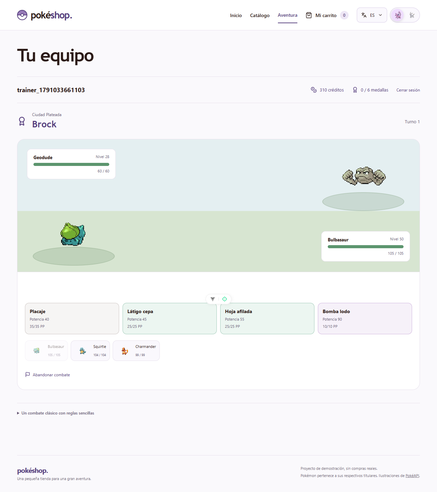

# Aventura de entrenadores

[English](adventure.md) · [Español](adventure.es.md)

La aventura es un reto privado de Kanto para un jugador, junto al catálogo público y el carrito de demostración. Cada entrenador recibe 1.000 créditos ficticios una vez, compra Pokémon para su colección y guarda un equipo ordenado de hasta seis miembros. El primero inicia el combate. La vida y los PP se recuperan al comenzar otra batalla; perder o abandonar no cuesta créditos.

[](adventure.png)

[Interfaz móvil](adventure-mobile.png) · [Compras desde el catálogo](catalog-trainer.png). Capturas de la vista local.

## Acceso y despliegue

Antes de abrir la aventura, aplica la migración y crea una invitación:

```sh
docker compose exec backend alembic upgrade head
docker compose exec backend python -m src.adventure.invitations --hours 72
docker compose exec backend python -m src.adventure.invitations --revoke CODIGO
```

En producción usa `docker compose -f compose.production.yaml ...`. Entrega el código directamente al visitante; no lo publiques en el portfolio ni lo guardes en Git. Solo se almacena su resumen SHA-256. Las invitaciones caducan, admiten un registro y pueden revocarse antes de utilizarse. La creación se hace por CLI, sin endpoint público. Revocar una invitación no desactiva una cuenta ya creada.

Configura `ALLOWED_ORIGINS` con los orígenes exactos del frontend, incluido HTTPS. `ENVIRONMENT=production` activa cookies Secure. Las sesiones duran siete días, se guardan como resúmenes y utilizan cookies HttpOnly/SameSite=Strict limitadas a la API de la aventura. Las escrituras requieren además el token CSRF devuelto por `/me`. Las contraseñas usan scrypt con sal. Registro y login comparten límites persistentes de 20 intentos cada 15 minutos por conexión y nombre de usuario. Con el proxy actual el límite por conexión se comparte entre visitantes; no se confía en cabeceras reenviadas de IP. Esta versión no incluye recuperación de contraseña ni verificación de correo.

## Reglas y economía

- Las compras reutilizan `/catalogo`, sus tarjetas, búsqueda, filtros, paginación y fichas. Con sesión de entrenador se muestran los precios en créditos del servidor y se añaden Pokémon al carrito existente y se confirma toda la compra desde allí. El catálogo filtra inicialmente los 26 Pokémon de Kanto que pueden combatir; desmarcar el filtro muestra todas las especies y señala las no disponibles. El orden por precio utiliza créditos. La demostración sin sesión mantiene su carrito en euros. Un ejemplar por especie y entrenador, sin intercambios, evolución ni pagos reales.
- Precio en créditos: `100 + 2 × máximo(0, suma de estadísticas base − 250)`, redondeado a decenas y con mínimo 100. Es independiente de los precios de demostración en euros y de su stock compartido. Es una política inicial que necesita pruebas de equilibrio.
- Tus Pokémon tienen nivel 50; los gimnasios, niveles 28, 34, 38, 42, 46 y 50. Los equipos y cuatro movimientos están definidos en `backend/src/adventure/content.py`.
- Incluye daño físico/especial, bonificación por tipo propio, efectividad moderna con tipos dobles e inmunidades, velocidad, prioridad, precisión, PP, cambios y Forcejeo con retroceso. Los empates de velocidad/prioridad se resuelven al azar en el servidor. El rival elige el mayor daño estimado ajustado por precisión.
- Las reglas son simplificadas: no se aplican habilidades pasivas, críticos, estados, cambios de estadísticas, objetos, IV/EV, efectos secundarios ni reglas exactas de una generación. Patada baja tiene potencia fija 50; Megaagotar no cura y Rapidez usa la precisión simplificada. La interfaz lo explica antes de jugar.
- Un Pokémon debilitado se sustituye por el siguiente sano según el orden del equipo. Cambiar voluntariamente consume el turno. Cuando no quedan PP se permite Forcejeo. Si ambos equipos caen a la vez, el entrenador pierde.
- Los seis gimnasios se desbloquean en orden. La primera victoria concede medalla y 150/200/250/300/350/400 créditos. Las revanchas son prácticas gratuitas sin recompensa adicional. Una restricción única impide duplicar medallas y premios.

La venta desde la colección requiere confirmación y devuelve la mitad del precio original pagado, redondeada hacia abajo. El servidor retira el Pokémon de la colección y del equipo guardado. No se puede vender durante un combate activo. La confirmación del carrito valida todas las líneas y el saldo en una transacción; cualquier fallo revierte toda la compra. La migración `004` añade recibos persistentes por entrenador para compras y ventas. Repetir la misma petición tras perder una respuesta devuelve el recibo original sin volver a cobrar ni abonar. El borrador del carrito se guarda por entrenador en el navegador; no concede propiedad.

## Autoridad y recuperación

El servidor calcula precios, saldo, propiedad, turnos y decisiones del rival. Las transacciones bloquean primero al entrenador para serializar operaciones. Cada batalla guarda su estado y revisión; un turno repetido o antiguo devuelve 409. Solo puede existir una batalla activa por entrenador. Se comprueba la propiedad al leer y modificar cada combate. Recargar o cerrar sesión conserva el progreso y la batalla.

El navegador representa los eventos del servidor y su estado final. Si se pierde una respuesta, recupera el estado antes de reintentar. El carrito de demostración no concede Pokémon para la aventura.

## Verificación

Verificado localmente el 03/10/2026: pasan 24 pruebas de aventura, 21 regresiones anteriores del backend, 19 pruebas unitarias del frontend y las 34 pruebas de Chrome. También pasan tipos, ESLint, compilación de producción y Ruff. El navegador cubre registro, compras, persistencia del equipo, recarga del combate, cambios de idioma, anchos 320/375/414/768/1280, primera victoria y desbloqueo, salida/entrada y un ataque confirmado cuya respuesta se pierde y recupera sin repetirlo. Una prueba reproducible con estadísticas reales de Kanto verifica una ruta asequible por los seis gimnasios; demuestra viabilidad, no un equilibrio exhaustivo del juego.

Las pruebas deben ejecutarse únicamente en una base separada y migrada cuyo nombre comience por `adventure_test`. Vacían las tablas de aventura y escriben fixtures biológicos allí.

```sh
# Configura POSTGRES_DB=adventure_test_<sufijo> solo en el proceso de pruebas.
python -m unittest tests.test_adventure -v
```

La prueba de navegador requiere también una base desechable y una invitación nueva:

```sh
PLAYWRIGHT_BASE_URL=http://localhost:5173 PLAYWRIGHT_ADVENTURE_CODE='<codigo-de-un-uso>' pnpm --dir frontend test:e2e
```

Sin esa variable se omite el registro de la aventura. `PLAYWRIGHT_CHANNEL=chrome` permite utilizar Chrome instalado en lugar de Chromium de Playwright. No guardes invitaciones ni trazas de Playwright en Git.

Se verifican transacciones reales de PostgreSQL, invitaciones, autenticación, CSRF/origen, compras concurrentes, precios calculados por servidor, propiedad del equipo, recuperación/revisión de combates y premios únicos. Los sprites proceden de [PokeAPI/sprites](https://github.com/PokeAPI/sprites). Pokémon y sus personajes pertenecen a sus respectivos titulares. Sigue siendo una demostración no comercial para portfolio.
